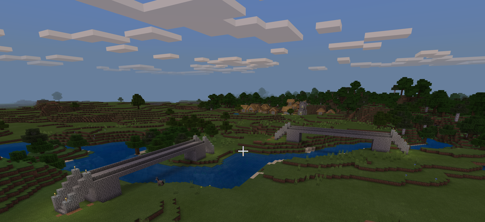
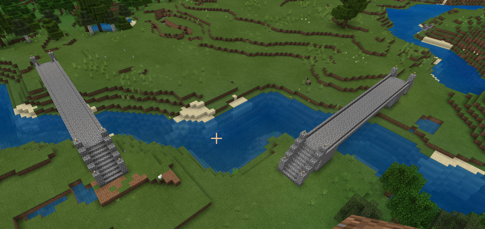

# Minecraft Makecode Bridge Script

Skrypt tworzący mosty w grze Minecraft Education Edition z wykorzystaniem dodatku MakeCode.  
Tworzony most może być dostosowywany względem: wysokości, długości i kierunku w jakim ma się budować. Do budowania wykorzystywany jest agent.  

### Uruchamianie:
* Załadować skrypt w Minecraft MakeCode (plik `.mkcd`)
* Wpisać na czat komendę `bridge height length direction`

Gdzie:  
* height to liczba całkowita oznaczająca wysokość mostu
* length to liczba całkowita oznaczająca długość mostu
* direction to liczba określająca kierunek budowania mostu zgodnie z poniższym:
 * 0 - NORTH
 * 1 - EAST
 * 2 - SOUTH
 * 3 - WEST

#### Przykładowo wygenerowane budowle

#### Gif przedstawiający budowę

 
