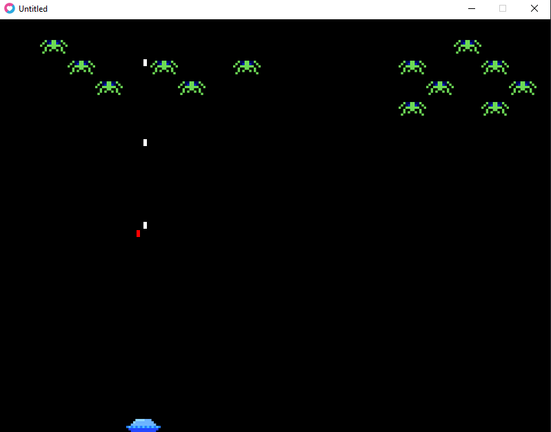
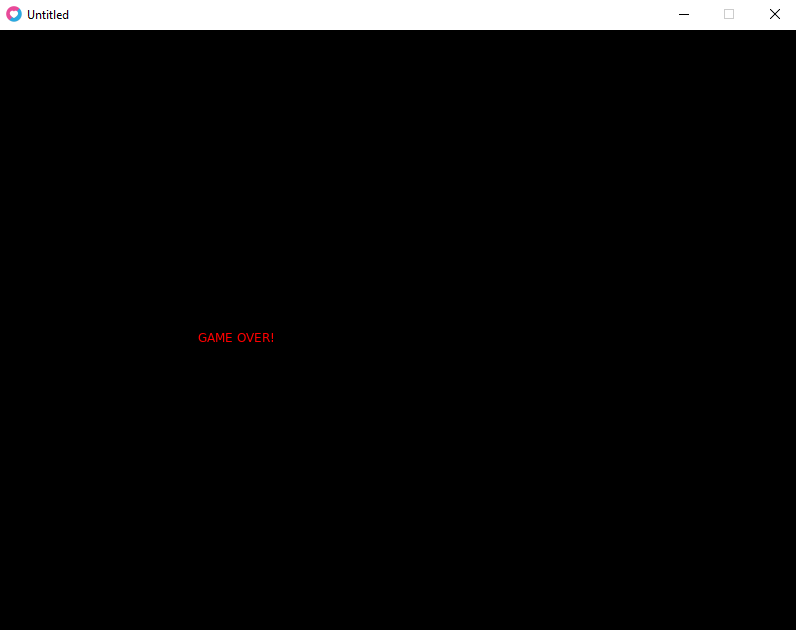
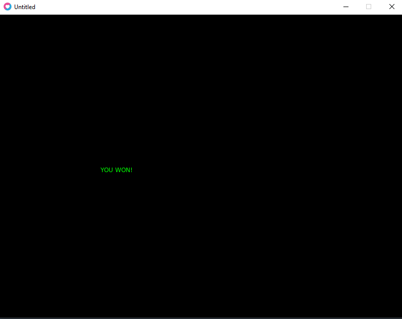

# Space Invaders Lua

Prosta implementacja gry Space Invaders napisana w języku Lua z wykorzystaniem bilbioteki LOVE 2D

### Uruchamianie:
`path/to/love/exe path/to/this/directory`
example:
`/c/Program\ Files/LOVE/love.exe /d/programs/space-invaders`

### Opis

### Wygląd gry

#### Ekran gry

#### Ekran końca gry

#### Ekran ukończenia gry

Images: 
https://opengameart.org/content/8-bit-alien-assets
Sounds: 
https://www.zapsplat.com/sound-effect-category/lasers-and-weapons/
https://www.jamendo.com/track/271084/zone
https://freesound.org/people/kyles/sounds/452596/
https://freesound.org/people/Taira%20Komori/sounds/212757/
 
