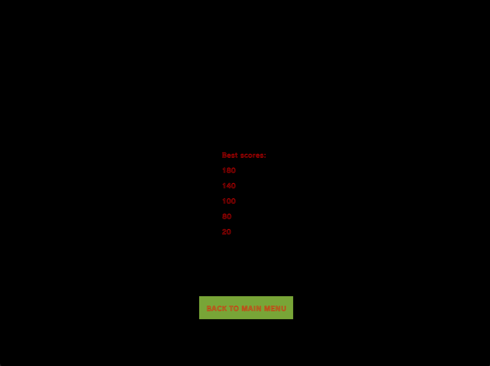
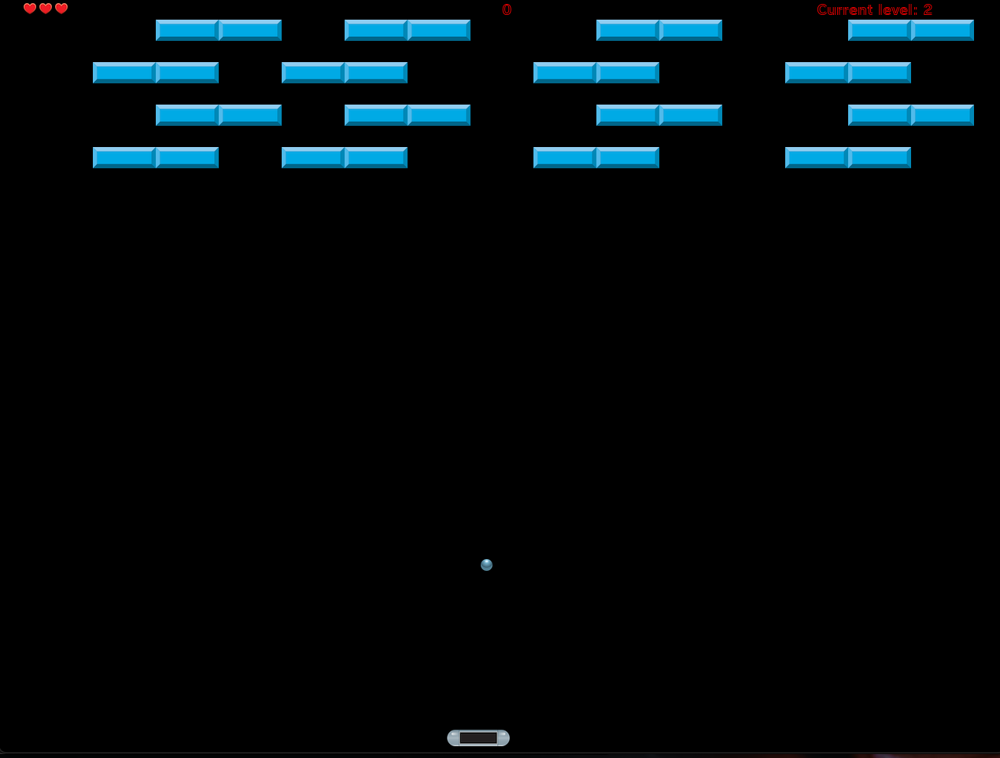
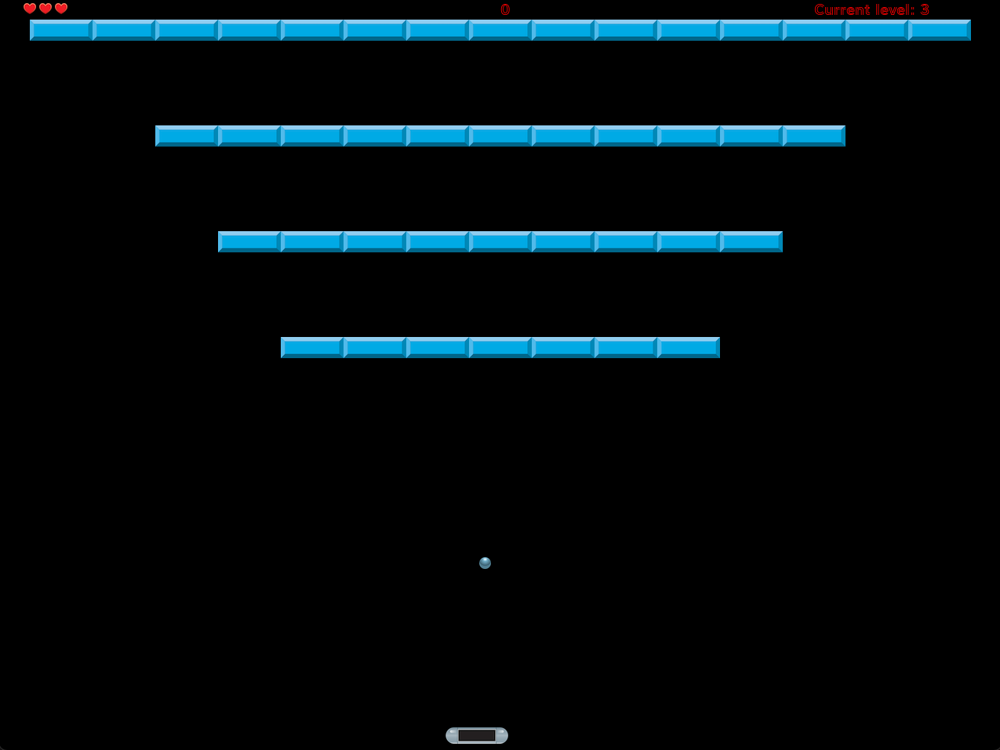
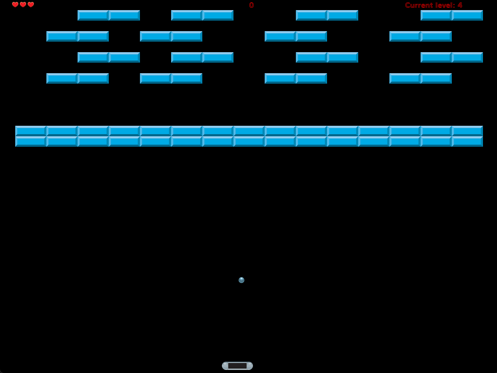
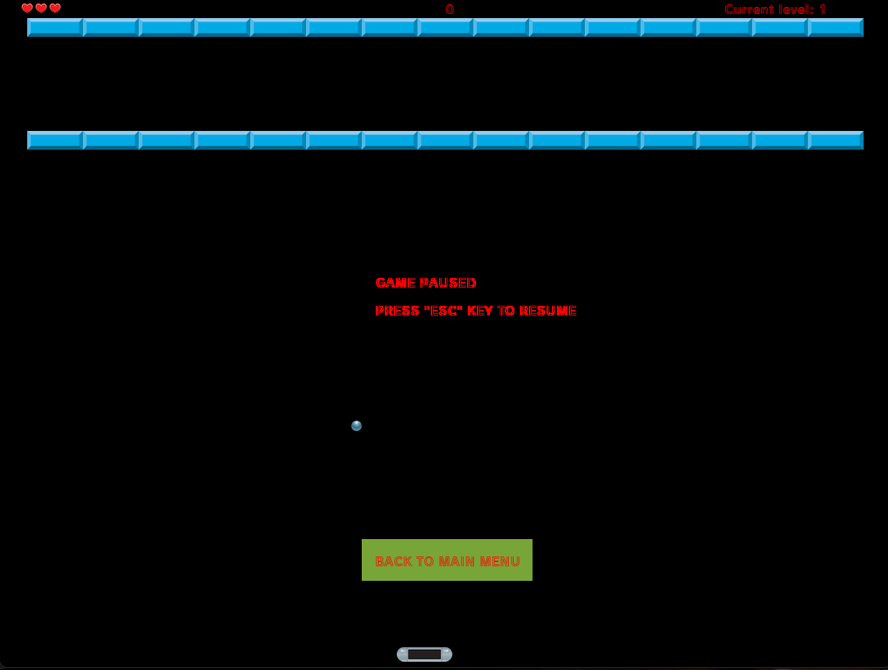
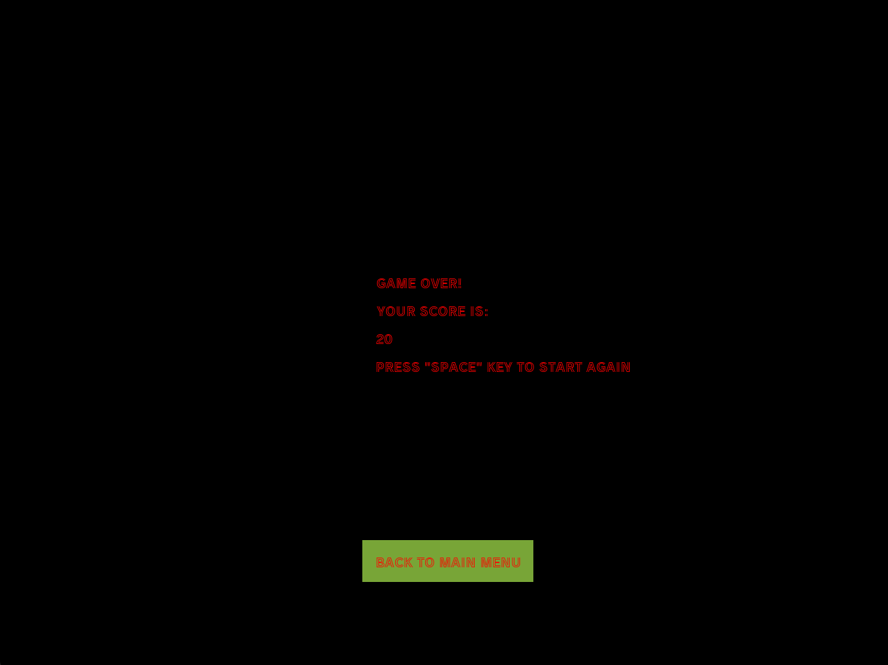
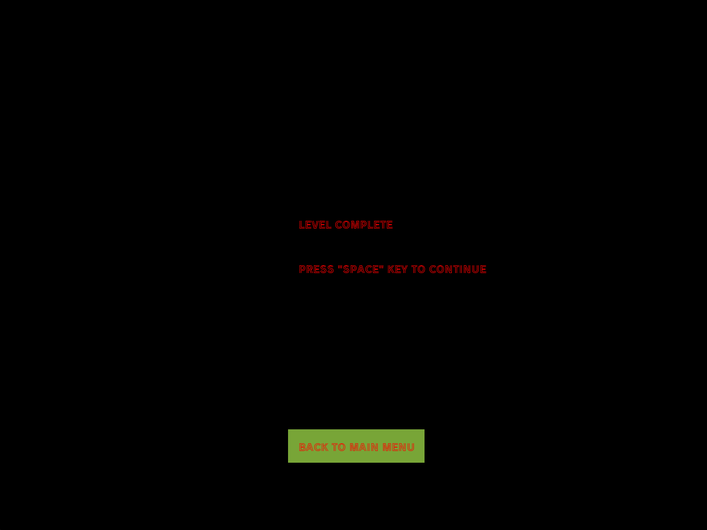
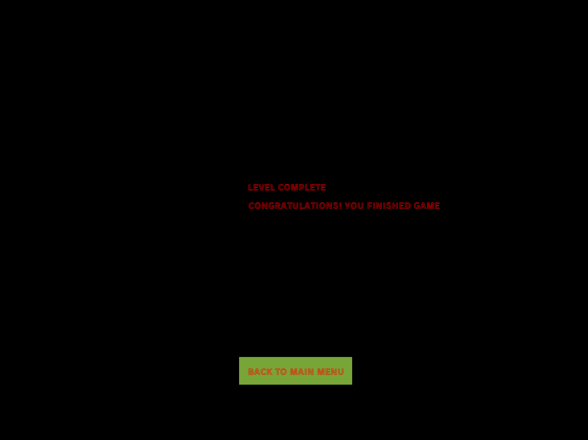

# Arkanoid Python

Prosta implementacja gry Arkanoid napisana w języku python

### Uruchamianie:
`python breakout.py`

### Opis

* W katalogu `levels` znajdują się poziomy gry w postaci plików JSON.
  
Plik ma strukturę jak poniżej:
```
{
  "ball": {
    "xVelocity": 3.0,
    "yVelocity": 3.0
  },
  "blocks": [
    {
      "x": 80,
      "y": 40
    },
  ]
}
```

Gdzie klucz `ball` zawiera dane na temat prędkości piłeczki względem osi OX i OY,
a klucz `blocks` zawiera tablicę współrzędnych klocka w postaci obiektu `{x, y}`

* W katalogu `images` znajdują się użyte assety
* W katalogu `fonts` znajdują się użyte czcionki
* W katalogu `sounds` znajdują się użyte dźwięki i piosenki
* W katalogu `save` znajduje się plik JSON do zapisu 5 najlepszych wyników

### "Fizyka" piłeczki

Piłeczka przyjmuje 2 prędkości odpowiednio dla osi OX i OY. Prędkości te są zadeklarowane w pliku poziomu.

* Odbicia od powierzchni:
  * Przy uderzeniu w horyzontalną krawędź okna gry lub klocka kierunek jest zmieniany na przeciwny na osi 
    OY np. `"up" -> "down"`
  * Przy uderzeniu w wertykalną krawędź okna gry lub klocka kierunek jest zmieniany na przeciwny na osi OX np. `"left" -> "right"`
  * Przy uderzeniu w kant klocka kierunek jest zmieniany na przeciwny na osi OX i OY np. `"left" -> "right"` oraz `"up" -> "down"`

* Odbicia od platformy gracza
  * Na osi OY kierunek zawsze jest zmieniany na `"up"`
  * Na osi OX zmiana kierunku NIE następuje, gdy gracz nie porusza platformy lub porusza się zgodnie z kierunkiem piłeczki na osi OX
  * Kierunek na osi OX zmieni się gry gracz porusza platformą w kierunku przeciwnym do kierunku piłeczki na osi OX

### Wygląd gry

#### Menu główne


* Wciśnięcie "Start" rozpoczyna grę od poziomu 1
* Wciśnięcie "Scores" przenosi na ekran wyników
* Wciśnięcie "Exit" wyłącza grę

#### Ekran wyników


* Wyświetlane jest 5 najlepszych wyników
* Wciśnięcie "Back to menu" przenosi do menu głównego

#### Poziomy
Poziom 1


Poziom 2


Poziom 3


Poziom 4


Poziom 5


#### Menu pauzy
Aby uruchomić menu pauzy podczas gry, należy wcisnąć przycisk Escape/ESC


#### Ekran końca gry
Wyświetla się, jak graczowi się skończą "życia". Po wciśnięciu klawisza spacji gra zaczyna się od nowa (od 1 poziomu).


#### Ekran przejścia poziomu
Wyświetla się, jak wszystkie bloki zostaną zbite i nie jest to ostatni poziom. 
Po wciśnięciu klawisza spacji rozpoczyna się następny poziom.


#### Ekran ukończenia gry
Wyświetla się, jak wszystkie bloki zostaną zbite i jest to ostatni poziom. 

